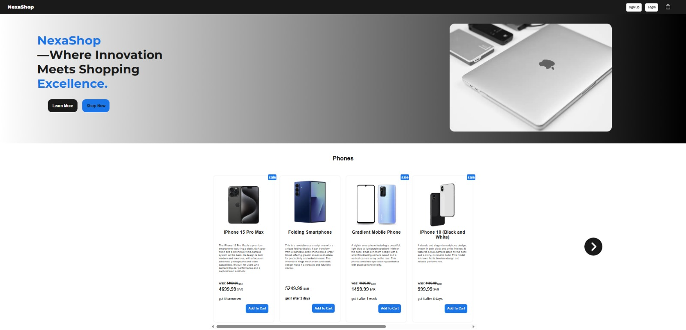
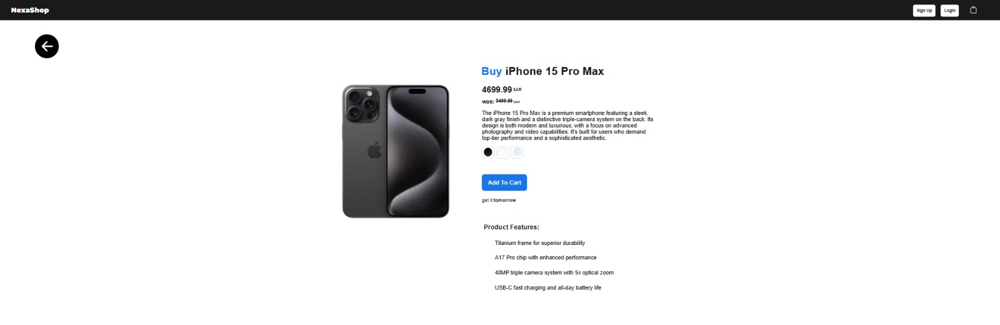
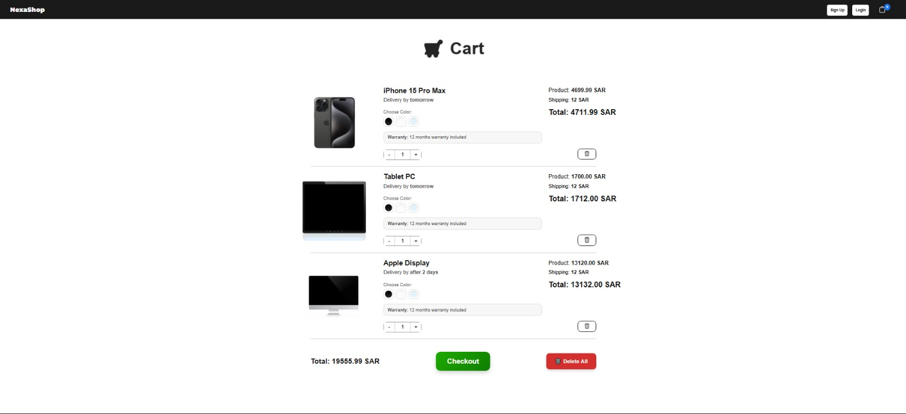
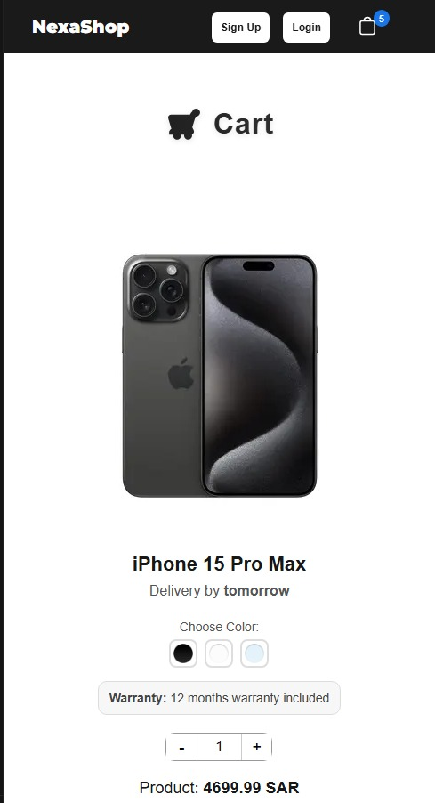

# NexaShop E-Commerce Website

A modern e-commerce web application built with Next.js, designed as a portfolio project to showcase frontend architecture, UI/UX decisions, and scalable component structure.

## 🛠 Tech Stack
- Next.js (App Router)
- React
- JavaScript
- CSS Modules
- Client-side state management

## 🧠 Architecture Decisions
- Used Next.js App Router for better scalability and route-based layouts
- Server components used where possible to improve performance
- Client components isolated for cart and interactivity

## ✨ Features
- Responsive layout for all screen sizes
- Product listing with reusable card components
- Client-side cart logic
- Clean separation between UI, data, and logic
- Scalable folder structure suitable for real-world apps
- Static product data (no backend – portfolio purpose)

## 📁 Project Structure
src/
├─ app/
│  ├─ api/          # API For products data
│  ├─ cart/         # Shopping cart page and logic
│  ├─ login/        # Login page
│  ├─ signup/       # Signup page
│  ├─ product/      # Product pages
│  ├─ layout.jsx    # Main layout wrapper
│  └─ page.jsx      # Homepage
│
├─ components/
│  ├─ Header/       # Header component
│  ├─ Footer/       # Footer component
│  ├─ Hero/         # Hero section
│  └─ Products/     # Products section
│
├─ elements/        # Small reusable components
│  ├─ Logo/
│  ├─ LoginLogo/
│  └─ SignLogo/
│
├─ styles/          # CSS or module files

Each component is responsible for a single concern to keep the codebase clean and maintainable.

## 🎨 UI / UX Decisions
- Minimal and distraction-free product cards
- Clear call-to-action buttons
- Optimized spacing and typography for readability
- Desktop-first layout with full mobile responsiveness

## 📚 What I Learned
- Structuring scalable Next.js applications
- Building reusable UI components
- Managing client-side state without external libraries
- Creating clean UI/UX for e-commerce platforms

## 📸 Screenshots

### Homepage

### Product Detail Page

### Cart Page

### Mobile View

## 🚀 Installation
npm install
npm run dev

## 🌍 Live Demo
https://your-project.vercel.app

## 👤 Author
MAJD  
Frontend Developer  
GitHub: https://github.com/username